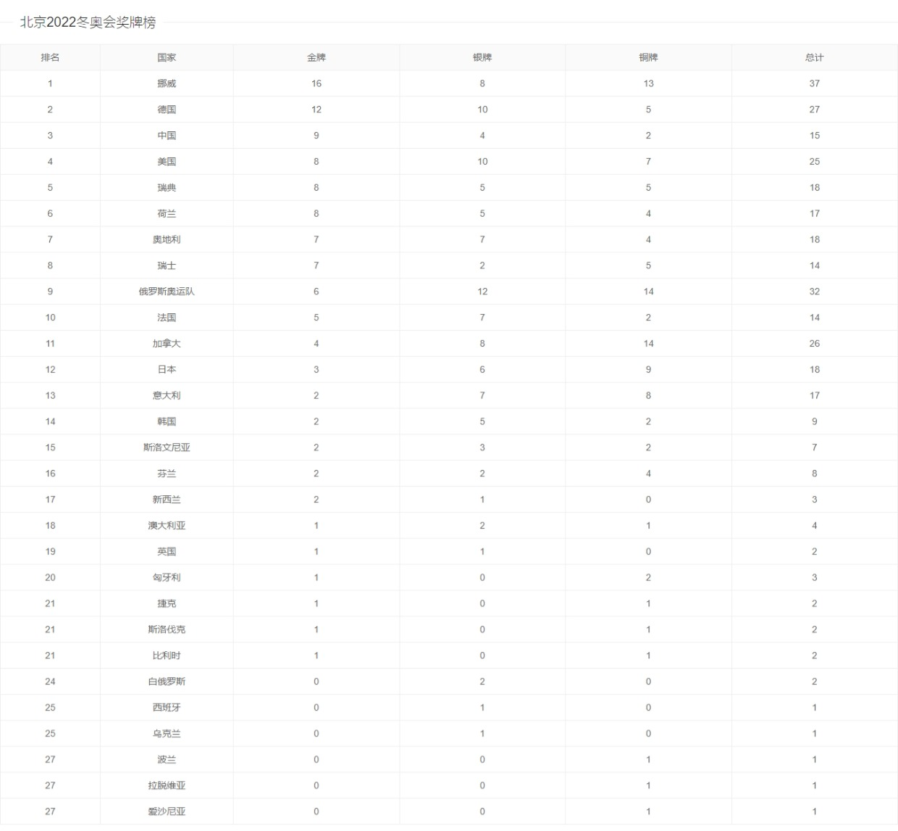

[](https://github.com/Vogadero/2022-WinterOlympicsMedalList)


# 项目简介🚩

- 2022年冬奥会奖牌榜
- 演示地址：https://vogadero.github.io/2022-WinterOlympicsMedalList/

## 1. 功能模块🎨

#### 1.1 首页🛫

| 功能                   |
| ---------------------- |
| 展示2022年冬奥会奖牌榜 |

## 2. 截图⭐



## 3. 项目架构🍽️

| 系统分层 | 使用技术                    |
| -------- | --------------------------- |
| 客户端   | Art-template、jQuery、layui |

## 4. 项目运行环境搭建🌈

- 克隆远端数据仓库到本地：`git clone 仓库地址`
- 拉取远程仓库中最新的版本：`git pull 远程仓库地址 分支名称`
- 双击index.html

# 功能介绍🦷

## 🕵️‍♀️查看

- 展示内容：2022年冬奥会奖牌榜

- API

  - 地址：https://api.cntv.cn/olympic/getBjOlyMedals

  - 方式：GET

  - 参数类型：jsonp

  - 缓存设置：true

  - 参数：

    | 参数名    | 说明                               |
    | --------- | ---------------------------------- |
    | serviceId | 2022dongao                         |
    | itemcode  | GEN------------------------------- |
    | t         | jsonp                              |
    | cb        | omedals1                           |


# Tree🌵    

```
2022年冬奥会奖牌榜
├─ 01.jpeg
├─ index.html
├─ js
│  ├─ jquery-3.6.0.min.js
│  └─ template-web.js
├─ layui-v2.6.8
│  └─ layui
│     ├─ css
│     │  ├─ layui.css
│     │  └─ modules
│     │     ├─ code.css
│     │     ├─ laydate
│     │     │  └─ default
│     │     │     └─ laydate.css
│     │     └─ layer
│     │        └─ default
│     │           ├─ icon-ext.png
│     │           ├─ icon.png
│     │           ├─ layer.css
│     │           ├─ loading-0.gif
│     │           ├─ loading-1.gif
│     │           └─ loading-2.gif
│     ├─ font
│     │  ├─ iconfont.eot
│     │  ├─ iconfont.svg
│     │  ├─ iconfont.ttf
│     │  ├─ iconfont.woff
│     │  └─ iconfont.woff2
│     └─ layui.js
├─ README.md
└─ 奖牌.ico
```